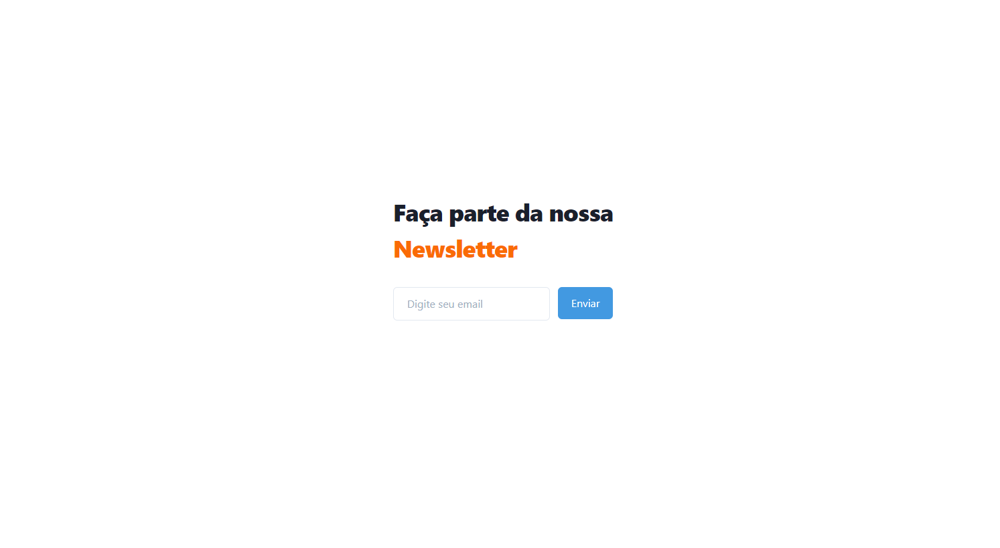

  <a href="#-tecnologias">Tecnologias</a>&nbsp;&nbsp;&nbsp;|&nbsp;&nbsp;&nbsp;
  <a href="#-projeto">Projeto</a>&nbsp;&nbsp;&nbsp;

  

## ✨ Tecnologias

Esse projeto foi desenvolvido com as seguintes tecnologias:

- HTML
- [TailwindCSS](https://tailwindcss.com/)

## 💻 Projeto

A newsletter é um projeto para criar junto com as requisições HTTP do Google Forms uma nova cara para formulários e submissões.

Developed by: [@rafaelpdemelo](https://instagram/rafaelpdemelo)
